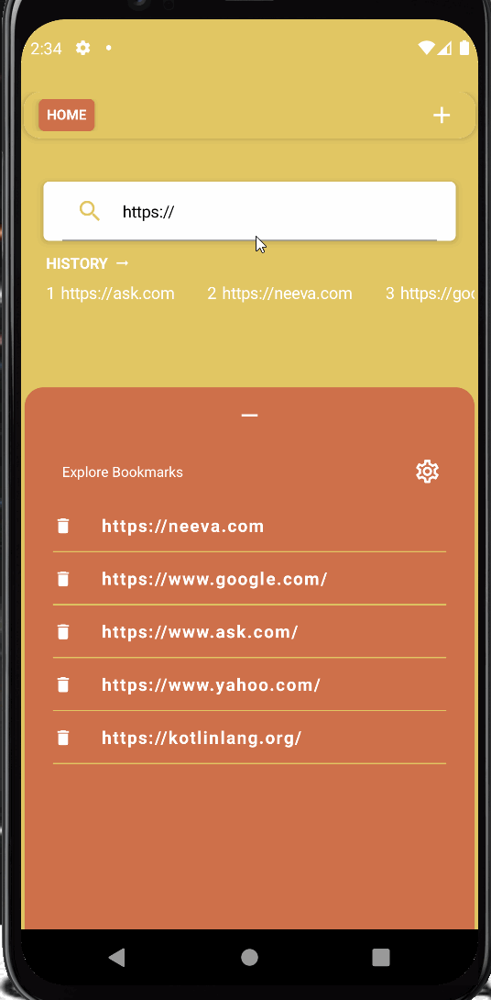
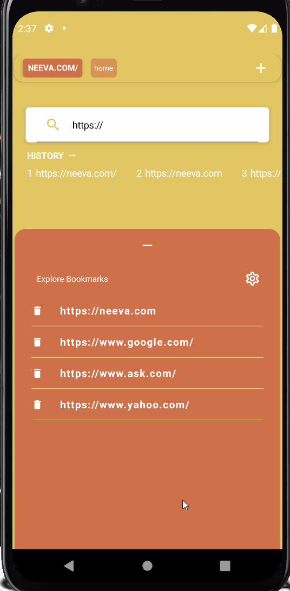

# Running The Project
**AcmeMobileBorwser**  is a native android application that allows users to browse the web, manage bookmarks, and track their
browsing history. To run the app, simply launch through the emulator or sync with an Android device.
This app was built using the latest version of Jetpack Compose and Navigation, so the latest implementations of these libraries are necessary.

## Features
The following user stories are included:

* [x] Three separate screens: HomeScreen, EditBookmarkScreen, WebviewScreen
* [x] **HomeScreen** is the launching point for new tabs.
* [x] **HomeScreen** has sections for viewing history, a convenient bookmark view, and a search bar for querying new searches.
* [x] **EditBrowserScreen** allows the user to add and remove bookmarks from the bookmark cache.
* [x] **WebviewScreen** is built on top of Android's built-in WebView component. It allows for browsing the web using various navigation icons.
* [x] **WebviewScreen* Contains a custom search bar, storing the forward and back information to allow easy navigation.
* [x] The app allows users to maintain multiple tabs which store up-to-date URLs specific to each.
* [x] 10 unit tests

## Approach To The Project
My first step was to research the various components I would use to build the app.
After researching, I built a bare-bones, functioning draft.

I then put together 10 separate tests.I used these tests and my interaction with the app to iron out kinks and improve general performance.

Lastly, I worked on aesthetics and usability design after spending some time interacting with the app during the building process.
I like the approach of saving usability and ui design until the end when I can interact more robustly with the app.

## Video Walkthroughs
I have included three short gifs within the project file briefly showing some of the functionality of the three screens.
**HomeScreen**:

**EditBrowserScreen**:

**WebviewScreen**:

The gifs were created with [LiceCap](http://www.cockos.com/licecap/).